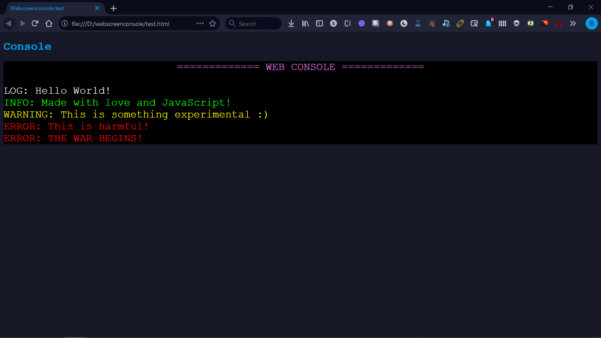

# webscreenconsole

My attempt to do a custom web console with JavaScript :)

<br><br>

### Usage

You can take look at [this example](https://github.com/Rabios/webscreenconsole/blob/master/test.html) that explains usage of it!

### Functions

- `console.load(elem);` Loads console which takes element.
- `console.close();` Closes console and removes all content within it (With removing it).
- `console.show();` Shows console.
- `console.hide();` Hides console (Without taking space).
- `console.log(msg);` Logs simple log message.
- `console.info(msg);` Logs info log message.
- `console.warning(msg);` Logs warning log message.
- `console.error(msg);` Logs error log message.
- `console.clear();` Clears console!

### Console properties

This custom web console is customizable, It allows anyone to set background, Font with a size, Or even colors!

You can go to `webscreenconsole.js` and edit `console` Object for this which is the following:

```js
var console = {
    log_colors: {
        head: "violet",
        log: "white",
        info: "lime",
        warning: "yellow",
        error: "red"
    }, // Log colors
    font: "monospace",
    font_size: 24,
    background_color: "black",
    background_image: undefined // Put image link here to replace color with image as background!
}
```
